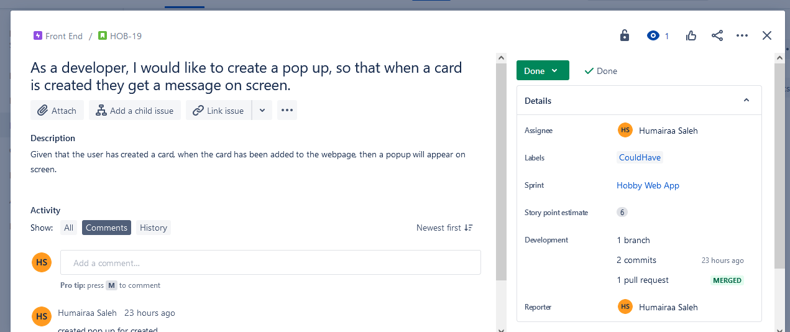

Hobby Web App README- Humairaa Saleh

#  **Workout Storer**

## **Introduction:**

In this project I have created a **CRUD** application using front-end and back-end development. I have created a 
web page where users can interact with it to create their workouts, delete them, read them and update them.

## Jira Board-

To plan my project, I created a **Scrum** board on **Jira** where I created epics and user stories.

### Epics:

* Documentation
* Front-End 
* Back-End
* Testing

I sectioned my user stories into these epics. Each user story had an **acceptance criteria**, **story points** and 
used the **MOSCOW model**. I also tried to include **smart commits** in my user stories where possible.

*Here is a link to my [Jira Board](https://poolpartyteam1.atlassian.net/jira/software/projects/HOB/boards/7/roadmap?shared=&atlOrigin=eyJpIjoiYjRlY2I0ZWNiZDIyNGRlMzkwZmIzOTBhNDIxYzJlNzgiLCJwIjoiaiJ9)*

*Here is an example of one of my **user stories**:*

## Risk Assessment-

Before I started my project I created a **risk assessment** to outline any risks I may encounter and how to respond to them. 

*Here is my **risk assessment**:*

## Git Repositories-

For my project, I created two repositories:

1. [FrontEndHobbyWebApp](https://github.com/humairaasaleh/FrontEndHobbyWebApp)
2. [BackEndHobbyWebApp](https://github.com/humairaasaleh/BackEndHobbyWebApp)

On both of these repositories, I used the same branch structure. I created a **main** branch, with a **dev** branch where I was working off,
then on the **dev** branch I would merge **feature** branches any time I woul commit something. At the end, I merged the **dev*** branch back to my ***main*** branch. I linked my **git** with my **Jira** board so I could make **smart commits** along the way. 

*Here is my **network graph** for my back end repository:*

## Database-

I used two databses in my project, a local **H2** database for my testing and a **MySQL** database to store the data from the application.

*Here is an **entity relationship diagram** of my database:*

*Here you can see how the data being changed on my website has been updated and stored in my database:*

## Back End Development-

I created the back end on eclipse using **Java** in a **Spring Boot Framework**. I created multiple packages to section my classes and interfaces.

*Here are some of my methods in my **controller** class:*

## Testing-

To test my code, I used **integration testing**. I used **MockMVC** to test my controller class. I acheived a test coverage of **84.3%**
on my main folder.

*Here are some examples of my tests that I created:*

## Front End Development-

For my website I used **HTML**,**CSS** and **Javascript** to create it. 

*Here is my webpage:*

*Using **Javascript**, I created this alert message to pop up when I created a new workout card:*

For my update method I created a **modal form** to update the cards. 

*This is what would pop up on the screen:*

As well as my get all method, I created a search bar to filter out the cards.

